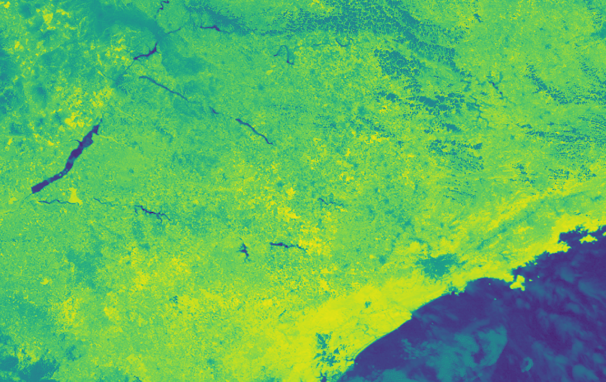
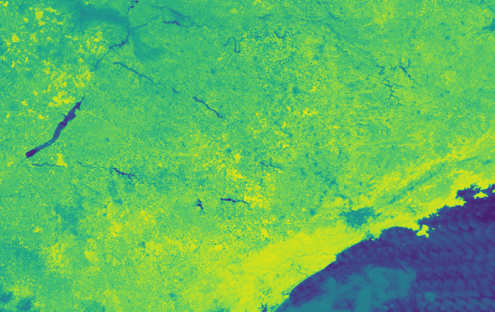

<!-- nocite: | -->
  <!-- "@protocloagro", "@orbitainpe", "@conab", "@trmm", "@landsat", -->
<!--   "@evibrasil", "@sugarcanesouth", "@ertsveg", "@aguiar2011remote", -->
<!--   "@morettin2006analise", "@aminikhanghahi2017survey", "@mvc", -->
<!--   "@killick2012", "@garcia1991mapping", "@killick2012optimal" -->

\renewcommand{\figurename}{Figura}
\renewcommand{\tablename}{Tabela}
\captionsetup[figure]{font=small}

```{r setup, include=FALSE}
knitr::opts_chunk$set(echo = FALSE, message = FALSE, warning = FALSE, fig.align = 'center')
```

<!-- \vspace{5px} -->
<!-- \begin{center} -->
<!-- \textbf{Resumo} -->
<!-- \end{center} -->

<!-- \pagebreak -->

## 1. Introdução

A cultura da cana-de-açúcar possui função cada vez mais estratégica na economia do país devido ao interesse em conciliar as preocupações relacionadas ao meio ambiente e a utilização dos combustíveis fósseis, que considera o balanço do lançamento de carbono na atmosfera e seus efeitos no aquecimento global.

Com propósito de redução da emissão de gases de efeito estufa (GEEs) na atmosfera, vem ocorrendo a eliminação gradativa do emprego de fogo para despalha da cana-de-açúcar, nas lavouras do estado de São Paulo. A mecanização da colheita sem queima prévia evita a emissão de gases de efeito estufa e beneficia o solo, pois deixa sobre ele a palha que antes era queimada, protegendo-o contra erosão e contribuindo para o aumento da sua fertilidade e teor de matéria orgânica [@conab].

O mapeamento e monitoramento das lavouras de cana-de-açúcar, com e sem a prática da queima da palha, torna-se importante para avaliar a eficácia do protocolo de intenções que a Secretaria do Meio Ambiente do Estado de São Paulo (SMA-SP) e a União da Indústria de Cana-de-Açúcar (UNICA) assinaram, em junho de 2007.

@protocloagro e @orbitainpe afirmam que técnicas de análise espacial com imagens de satélites são essenciais para o mapeamento e monitoramento da colheita da cana-de-açúcar com queima da palha. @rudorff2010studies e Gonçalves et al. (2012a e 2012b) confirmaram que imagens de satélites são eficientes para auxiliar a avaliação de características importantes do cultivo da cana-de-açúcar, proporcionando resultados relevantes para o debate sobre a produção sustentável de etanol. [@sugarcanesouth], avaliando a precisão do mapeamento temático da cana-de-açúcar por meio de imagens de satélites, chegaram a estimativas precisas das áreas de cana-de-açúcar para fins de estatísticas agrícolas empregradas no monitoramento da expansão de cultura no país.

As áreas de plantio serão modeladas como séries temporais a cada hora espacialmente dependentes entre si, por um processo de média móvel (ARMA) [@morettin2006analise], incluindo um componente de pontos de mudança [@aminikhanghahi2017survey]. O interesse principal é identificar quantos pontos de mudança foram observados, em quais momentos e qual a mudança resultante.

## 2. Objetivos

### 2.1 Objetivo Geral

O projeto tem, como objetivo geral, monitorar a colheita de cana-de-açúcar da safra 2019/2020, por meio de imagens do satélite GOES-16, quantificando as áreas colhidas com e sem queima.

### 2.2 Objetivos Específicos

Os objetivos específicos são: i) Analisar a variação dos valores do NDVI da cana-de-açúcar no estado de São Paulo no período de colheita da cultura; ii) Selecionar as áreas colhidas de cana-de-açúcar e verificar se houve ou não colheita por queima; iii) Quantificar a área colhida de cana-de-açúcar por queima e não queima.

## 3. Resumo de atividades

### 3.1 Extração de dados

Em 2018, com recursos da Financiadora de Estudos e Projetos (Finep), o Centro de Pesquisas Meteorológicas e Climáticas Aplicadas à Agricultura (CEPAGRI) adiquiriu e instalou um sistema de recepção e processamento de imagens do satélite meteorológico GOES-16.

O sistema possui um software específico para o cálculo de índices a partir de diferentes faixas espectrais. Entretanto, buscando maior controle sobre a qualidade, os cálculos dos índices utilizados neste projeto foram feitos diretamente com códigos implementados na linguagem de computação estatística, R. Assim, optou-se por fazer uso do software do sistema apenas para recorte da área de interesse e seleção das faixas espectrais, minimizando o tamanho em disco e, consequentemente, tempo de processamento.

Foram geradas imagens de índices de vegetação e queimadas a fim de acompanhar a cultura de cana e avaliar áreas onde houve queima pré-colheita. Para acompanhar a cultura de cana foi usado o Índice de Vegetação da Diferença Normalizada (NDVI), definido por @rouse1974monitoring e o Índice de Queima Normalizada (NBR) [@garcia1991mapping], para avialiação de áreas onde houve queima pré-colheita.

### 3.2 Redução de efeitos atmosféricos
 <!-- e efeitos de visualização off-nadir?? -->

A técnica de Composição de Máximo Valor (MVC) [@holben1986characteristics], minimiza contaminação por nuvens, âgulos de luz solar, efeitos de sombra, efeitos de aerosol e vapor de água e reduz refletância direcional. O procedimento avalia pixel por pixel de um conjunto de imagens em um período de tempo predeterminado, de forma que somente os pixeis com maiores valores são mantidos. Por fim, tem-se somente uma imagem resultante da combinação de todas no intervalo de tempo escolhido.

Foi fixado um intervalo de tempo de uma hora, com uma imagem a cada 10 minutos o MVC retornará uma combinação de seis imagens. A Figura 1 mostra o comparativo entre uma imagem recebida entre 15:00 e 16:00 UTC e o resultado do procedimento por MVC do mesmo intervalo de tempo.

<!--   -->

```{r, echo=FALSE, out.width="49%", out.height="20%", fig.cap="À esquerda, imagem com contaminação por nuvens e à direita resultado por MVC.", fig.show='hold', message=F, warning=F}
knitr::include_graphics(c("201907141540G16.SP_Bandas_2_3--L1B.png","2019071415.png"))
```
\newpage

### 3.3 Áreas de interesse

Com mais de 13 mil culturas canavieiras espalhadas pelo território do estado de São Paulo, optou-se por selecionar 200 aleatóriamente, reduzindo drasticamente o volume dos dados e otimizando o tempo de análise. Os pontos sorteados estão representados da Figura 2.

Os dados são provenientes de um estudo feito por @aguiar2011remote no Institudo Nacional de Pesquisas Espaciais (INPE).

```{r, fig.align='center', fig.show='hold', message=FALSE, fig.height=2.5, fig.cap="Localizações de plantios de cana-de-açúcar em São Paulo."}
library(viridis)
library(tmap)
library(sf)
library(raster)

load("parcial.RData")

sao_paulo <- st_transform(sao_paulo, crs = crs(ndvi_rast, asText=TRUE))
loc_plant <- st_transform(loc_plant, crs = crs(ndvi_rast, asText=TRUE))

tm_shape(ndvi_rast) + tm_raster(midpoint = 0, palette = viridis(1000), style = "cont", title = "NDVI") +
  # tm_shape(sao_paulo) + tm_borders(col = "white") +
  # tm_shape(loc_plant) + tm_bubbles(col="red", size = 0.05, alpha=1) +
  tm_graticules(col="white", lwd=0.5) +
  tm_layout(frame = F, legend.outside = T, legend.outside.position="right", legend.outside.size=0.2)
```

### 3.4 Análise estatística

A Figura 3 mostra um recorte de 16 km² ao redor de um dos pontos de plantio. Os pixeis presentes no recorte estão sendo modelados como séries temporais individuais espacialmente dependentes entre si, denotadas por $\{Y_{i, t}\}$ em que $t$ corresponde à $t$-ésima hora de medição após um tempo inicial $t_0$ e $i$ a um dos pixeis do recorte.

```{r, fig.align='center', fig.show='hold', message=FALSE, fig.height=2.2, fig.cap="Recorte de uma plantação de cana-de-açúcar em São Paulo."}
library(viridis)
library(tmap)
library(sf)
library(raster)

load("parcial.RData")

loc_plant <- st_transform(loc_plant, crs = crs(ndvi_rast_mtr, asText=TRUE))
sao_paulo <- st_transform(sao_paulo, crs = crs(ndvi_rast_mtr, asText=TRUE))
# ndvi_rast_raio <- crop(ndvi_rast_mtr, filter(loc_plant_2km, row_number() == 11))

tm_shape(ndvi_rast_raio) +
  tm_raster(midpoint = 0, palette = viridis(length(breaks)), style = "cont", title="NDVI", interpolate = FALSE) +
  tm_layout(legend.outside = T, legend.outside.position = "right", legend.outside.size = 0.1)
```

Seja $\{Y_{1, t}\}$ a série correspondente ao primeiro pixel, um ponto de mudança ocorre quando existe um tempo $t_{\tau}$ $\epsilon$ $\{0, ..., t-1\}$ em que as propriedades estatísticas de $\{y_{1, 0}, ..., y_{1, \tau}\}$ e $\{y_{1, \tau+1}, ..., y_{1, t}\}$ se diferem de alguma forma [@killick2012optimal].
\pagebreak

O objetivo da modelagem é separar e identificar os efeitos da variabilidade de diversos componentes, inclusive o efeito da auto-correlação das séries. Entretanto, o interesse principal é identificar quantos pontos de mudança foram observados no histórico ($m$), em quais momentos ($t_1, t_2, \ldots, t_m$) e qual a mudança resultante ($\alpha_1, \ldots, \alpha_m$).

Estão sendo utilizadas ferramentas computacionais disponíveis para análise de pontos de mudança individuais, sob perspectivas Bayesianas [@killick2014changepoint].

### 3.5 Cronograma de atividades

A Tabela 1 apresenta o cronograma das atividades sendo desenvolvidas no período de vigência do projeto, de 01 de agosto de 2019 a 31 de julho de 2020.

\begin{table}[H]
\centering
\caption{Cronograma de atividades previstas}\label{Tab1}
% definindo o tamanho da fonte para small
% outros possíveis tamanhos: footnotesize, scriptsize
\begin{small} 
  
% redefinindo o espaçamento das colunas
\setlength{\tabcolsep}{3pt} 

% \cline é semelhante ao \hline, porém é possível indicar as colunas que terão essa a linha horizontal
% \multicolumn{10}{c|}{Meses} indica que dez colunas serão mescladas e a palavra Meses estará centralizada dentro delas.

\begin{tabular}{|c|c|c|c|c|c|c|c|c|c|c|c|c|}\hline
 & \multicolumn{12}{c|}{Meses}\\ \cline{2-13}
\raisebox{1.5ex}{Etapa} & 01 & 02 & 03 & 04 & 05 & 06 & 07 & 08 & 09 & 10 & 11 & 12  \\ \hline
1     & \checkmark & \checkmark & \checkmark &   &   &   &   &   &   & x  & x  & x  \\ \hline
2     & \checkmark & \checkmark &   &   &   &   &   &   & x & x  &    &    \\ \hline
3     & \checkmark & \checkmark & \checkmark &   &   &   &   &   &   &    &    &    \\ \hline
4     &   &   &   & \checkmark & \checkmark & \checkmark & \checkmark &   &   &    &    &    \\ \hline
5     &   &   &   &   &   &   & \checkmark &   &   &    &    &    \\ \hline
6     &   &   &   &   &   &   & x & x & x & x  & x  &    \\ \hline
7     &   &   &   &   &   &   &   &   &   & x  & x  &    \\ \hline
8     &   &   &   &   &   &   &   &   &   &    & x  & x  \\ \hline
\end{tabular} 
\end{small}
\label{t_cronograma}
\end{table}

As etapas referentes ao desenvolvimento do projeto encontram-se a seguir:

1. Revisão bibliográfica

2. Coleta de dados de cana-de-açúcar colhida (máquina e queima)

3. Coleta de imagens da época de colheita de cana-de-açúcar

4. Processamento de imagens de vegetação e incêndio

5. Relatório parcial de atividades

6. Análise estatística dos dados adquiridos nos itens anteriores

7. Elaboração de artigo para o XXVII Congresso de Iniciação Científica da UNICAMP

8. Relatório final de atividades

A etapa de coleta de imagens demandou tempo de treinamento para operação do software do sistema de recepção e processamento, utilizado para recorte e seleção de bandas espectrais.

O processamento dos dados foi feito utilizando a linguagem de computação estatística, R. Sem conhecimento prévio em manipulação de dados espaciais, foi necessário um tempo para aprendizado e exploração dos dados recebidos.

Na Tabela 1 estão discriminadas as atividades já concluídas e as ainda a serem executadas, com \checkmark e x respectivamente. Sendo assim, o projeto está sendo desenvolvido conforme o cronograma.

## 4. Produção científica

Os códigos implementados até aqui estão disponíveis em https://github.com/wesleysatelis/GOES-16-image-analysis-for-biomass-burning-detection, estes são públicos e podem ser modificados de acordo com as necessidades específicas de cada um.
<!-- futuramente usar alguma licensa -->
\pagebreak

## Referências
